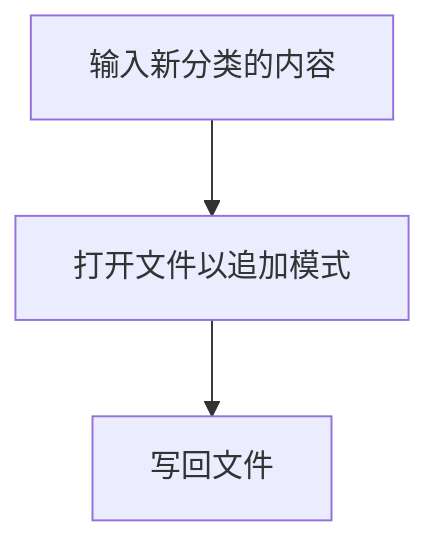
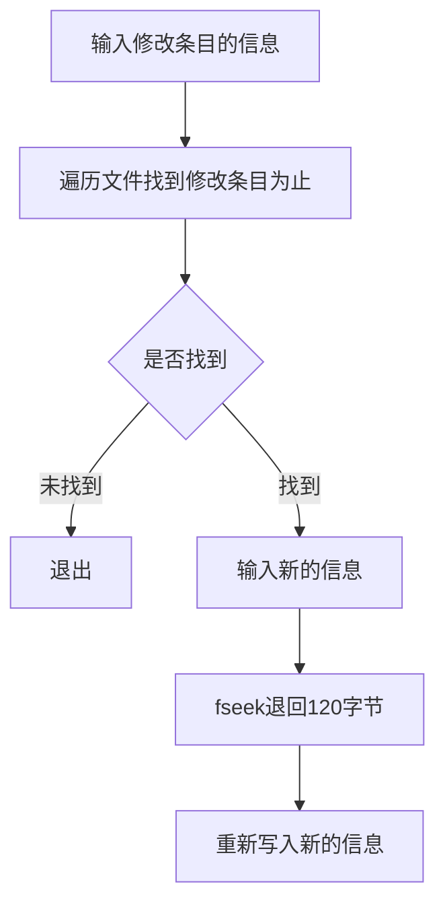
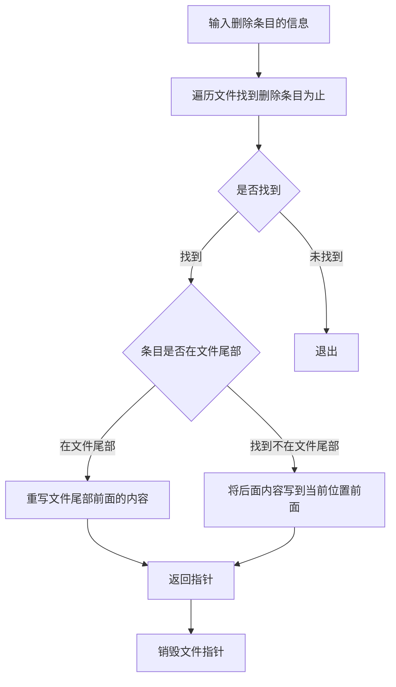
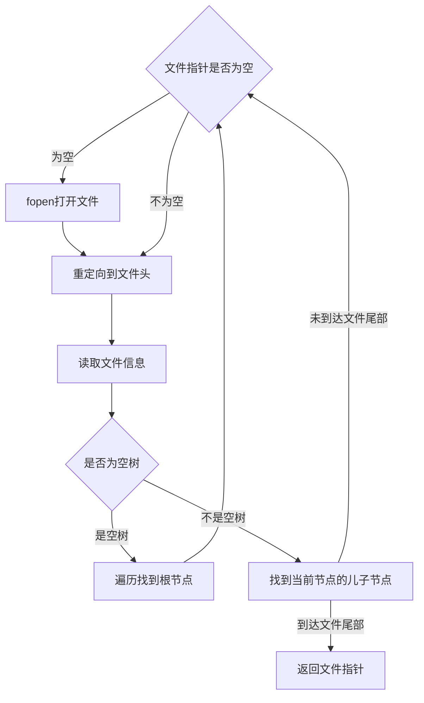

```mermaid
graph TB
输入新分类的内容-->打开文件以追加模式-->写回文件
```

```mermaid
graph TB
id1{是否找到}
输入修改条目的信息-->遍历文件找到修改条目为止
遍历文件找到修改条目为止-->id1--未找到-->退出
id1--找到-->输入新的信息
输入新的信息-->fseek退回120字节-->重新写入新的信息
```

```mermaid
graph TB
id{条目是否在文件尾部}
id1{是否找到}
输入删除条目的信息-->遍历文件找到删除条目为止
遍历文件找到删除条目为止-->id1--未找到-->退出
id1--找到-->id
id--在文件尾部-->重写文件尾部前面的内容-->返回指针
id--找到不在文件尾部-->将后面内容写到当前位置前面-->返回指针
返回指针-->销毁文件指针
```

```mermaid
graph TB
id1{文件指针是否为空}
id2{是否为空树}
id1--为空-->fopen打开文件-->重定向到文件头
id1--不为空-->重定向到文件头
重定向到文件头-->读取文件信息-->id2
id2--是空树-->遍历找到根节点-->id1
id2--不是空树-->找到当前节点的儿子节点--未到达文件尾部-->id1
找到当前节点的儿子节点--到达文件尾部-->返回文件指针
```

